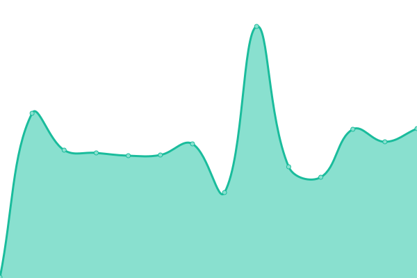

# [📈 Live Status](https://ops.skyseedllc.com): <!--live status--> **🟩 All systems operational**

This repository contains the open-source uptime monitor and status page for [billyus2025](https://ops.skyseedllc.com), powered by [Upptime](https://github.com/upptime/upptime).

With [Upptime](https://upptime.js.org), you can get your own unlimited and free uptime monitor and status page, powered entirely by a GitHub repository. We use [Issues](https://github.com/billyus2025/skyseed-upptime/issues) as incident reports, [Actions](https://github.com/billyus2025/skyseed-upptime/actions) as uptime monitors, and [Pages](https://ops.skyseedllc.com) for the status page.

<!--start: status pages-->
<!-- This summary is generated by Upptime (https://github.com/upptime/upptime) -->
<!-- Do not edit this manually, your changes will be overwritten -->
<!-- prettier-ignore -->
| URL | Status | History | Response Time | Uptime |
| --- | ------ | ------- | ------------- | ------ |
|  [EasyMathPrint](https://easymathprint.com) | 🟩 Up | [easy-math-print.yml](https://github.com/billyus2025/skyseed-upptime/commits/HEAD/history/easy-math-print.yml) | 

 0ms
     
 | 

<a href="https://ops.skyseedllc.com/history/easy-math-print">100.00%</a>
    

|  [EasyEnglishPrint](https://easyenglishprint.com) | 🟩 Up | [easy-english-print.yml](https://github.com/billyus2025/skyseed-upptime/commits/HEAD/history/easy-english-print.yml) | 

 178ms
     
 | 

<a href="https://ops.skyseedllc.com/history/easy-english-print">84.09%</a>
    

|  [EasySudokuPrint](https://easysudokuprint.com) | 🟩 Up | [easy-sudoku-print.yml](https://github.com/billyus2025/skyseed-upptime/commits/HEAD/history/easy-sudoku-print.yml) | 

 192ms
     
 | 

<a href="https://ops.skyseedllc.com/history/easy-sudoku-print">96.65%</a>
    

|  [SkyseedLLC](https://skyseed-llc.pages.dev) | 🟩 Up | [skyseed-llc.yml](https://github.com/billyus2025/skyseed-upptime/commits/HEAD/history/skyseed-llc.yml) | 

 0ms
     
 | 

<a href="https://ops.skyseedllc.com/history/skyseed-llc">100.00%</a>
    

<!--end: status pages-->

[**Visit our status website →**](https://ops.skyseedllc.com)

## 📄 License

- Powered by: [Upptime](https://github.com/upptime/upptime)
- Code: [MIT](./LICENSE) © [Anand Chowdhary](https://anandchowdhary.com), supported by [Pabio](https://pabio.com)
- Data in the `./history` directory: [Open Database License](https://opendatacommons.org/licenses/odbl/1-0/)
